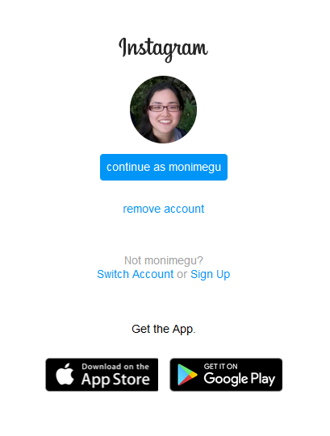

<h1 align="center">
    Clone of Instagram Landing Page/Login
</h1>

  <a href="#-technologies">Technologies</a>&nbsp;&nbsp;&nbsp;|&nbsp;&nbsp;&nbsp;
  <a href="#-project-description">Project Description</a>&nbsp;&nbsp;&nbsp;|&nbsp;&nbsp;&nbsp;

 

  &nbsp;&nbsp;

---

## 🤖 Technologies

- HTML
- CSS

## 💻 Project Description

Creating a instagram landing page as a learning and training experience with HTML and CSS.

---

Made with 💖 by [monisato](https://github.com/monisato) 👋
